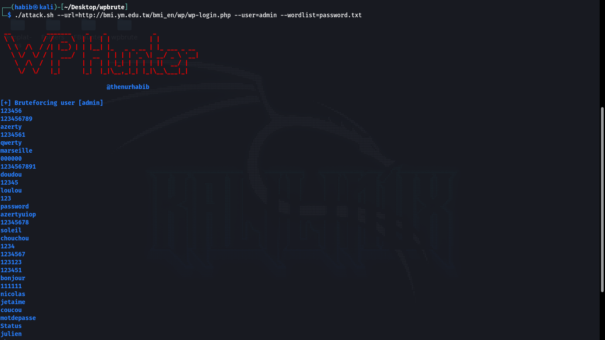
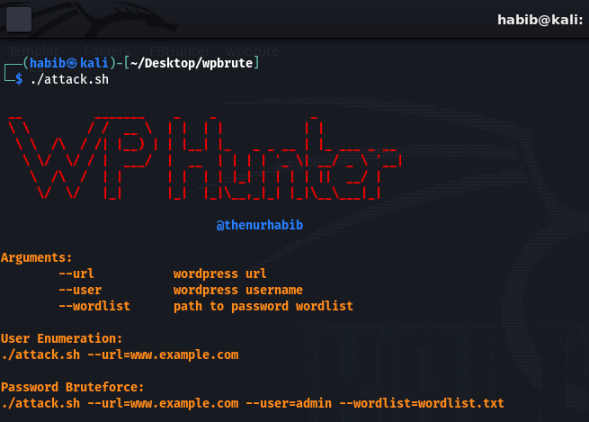

<h1 align="center">
  WP Hunter
  <br>
</h1>

<h4 align="center">Fastest tool to find username and password brute forcing.</h4>

<p align="center">
  <a href="https://github.com/thenurhabib/wphunter/releases">
    
  </a>
  <a href="https://travis-ci.com/thenurhabib/wphunter">
    
  </a>
  <a href="https://github.com/thenurhabib/wphunter/issues?q=is%3Aissue+is%3Aclosed">
      
  </a>
</p>



<hr>

### wp hunter is a fastest tool to detect username of an wordpress website and you can also perform password brute forcing in login page with default password file or you can use your own password list.

<br>

### Main Features
- Find Wordpress website username.
- Password bruteforcing.
- Default password file.
- Uou can use your own password list.


<br>



<br>


### Documentation
### install
```yaml
git clone https://github.com/thenurhabib/wphunter.git
cd wphunter
chmod -R 777 attack.sh
./attack.sh
```


#### Usage

```yaml
┌──(habib㉿kali)-[~/Desktop/wp hunter]
└─$ ./attack.sh 

 __          _______    _    _             _            
 \ \        / /  __ \  | |  | |           | |           
  \ \  /\  / /| |__) | | |__| |_   _ _ __ | |_ ___ _ __ 
   \ \/  \/ / |  ___/  |  __  | | | | '_ \| __/ _ \ '__|
    \  /\  /  | |      | |  | | |_| | | | | ||  __/ |   
     \/  \/   |_|      |_|  |_|\__,_|_| |_|\__\___|_|   
                                                        
                              @thenurhabib 

Arguments:
	--url		wordpress url
	--user		wordpress username
	--wordlist	path to password wordlist

User Enumeration:
./attack.sh --url=www.example.com

Password Bruteforce:
./attack.sh --url=www.example.com --user=admin --wordlist=wordlist.txt

```
<br>


### Author
```yaml
Name       : Md. Nur habib
Medium     : thenurhabib.medium.com
Twitter    : https://twitter.com/thenurhab1b
HackerRank : https://www.hackerrank.com/thenurhabib

```

##### Thank You.
